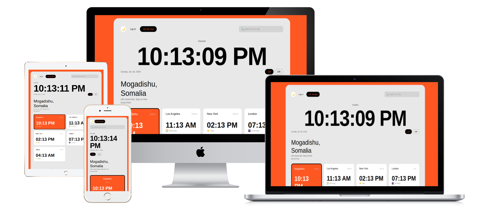

# 🌍 TimeScroll

**TimeScroll** is a responsive **World Clock web application** that displays the current time across multiple global cities in real time.  
Built using **HTML, CSS, and vanilla JavaScript**, this was my **second project for Code Institute**, with a strong emphasis on improving my **JavaScript skills**. TimeScroll emphasizes clean structure, accessibility, interactivity, and real-world development practices.

🔗 **Live Demo:**  
[https://sadikmohamud.github.io/world-timer](https://sadikmohamud.github.io/world-timer)

---

## 📌 Project Overview

TimeScroll allows users to view the current time in different cities around the world simultaneously.  
The application updates automatically, and users can:

- Search for cities dynamically  
- Toggle **dark mode** for a modern UI  
- View the time across multiple devices thanks to a **fully responsive design**  

This project was developed as part of my **Code Institute learning journey**, focusing on:

- Building responsive HTML/CSS layouts  
- Strengthening JavaScript skills (DOM manipulation, search functionality, dark mode toggle)  
- Debugging deployment issues like case-sensitive paths on GitHub Pages  
- Testing across multiple devices and browsers  

---

## ✨ Features

- ⏱️ Real-time world clocks  
- 🌐 Searchable list of cities  
- 🌓 Dark mode with toggle  
- 🔄 Automatic time updates  
- 📱 Fully responsive across desktop, laptop, tablet, and mobile  
- ♿ Semantic and accessible HTML  
- 🧼 Clean vanilla JavaScript, emphasizing JS practice  

---

## 🛠️ Technologies Used

- **HTML5** – semantic markup  
- **CSS3** – responsive styling and dark mode  
- **JavaScript (ES6)** – DOM manipulation, search logic, dark mode toggle  
- **GitHub Pages** – live deployment  

---

## 📂 Project Structure


📂 Project Structure
world-timer/
│
├── index.html
├── assets/
│   ├── css/
│   │   └── style.css
│   ├── js/
│   │   └── script.js
│   └── images/
│       └── responsiveness.png
└── README.md


---

## 🚀 How It Works

- JavaScript uses the `Date` object to calculate current times  
- Time zones are handled using UTC offsets  
- DOM updates dynamically at regular intervals  
- Search functionality filters cities in real time  
- Dark mode toggle switches CSS classes dynamically  
- Scripts are loaded with `defer` to ensure the DOM is ready before execution  

---

## 📱 Responsive Design Showcase

TimeScroll works seamlessly across **desktop, laptop, tablet, and mobile devices**.

<p align="center">
  
</p>

---

## 🧪 Local Setup

To run the project locally:

1. Clone the repository:
2. ## 📚 What I Learned

Strengthening JavaScript skills with real-world DOM manipulation

Implementing search functionality dynamically

Creating a dark mode toggle with CSS and JS

Handling time zones and real-time updates

Debugging case-sensitive deployment issues on GitHub Pages

Structuring assets and scripts for production

Building a fully responsive layout across devices

🤝 Acknowledgements

GitHub Copilot – for assistance with JavaScript logic

ChatGPT – for guidance on JavaScript path debugging and deployment

🔮 Future Improvements

More cities and dynamic time zone support

User-selected default city

Improved animations and transitions

Optional notifications for local events in each city

👤 Author

Sadik Mohamud
Junior Web Developer (HTML • CSS • JavaScript)

GitHub: https://github.com/sadikmohamud

📄 License

This project is open source and available under the MIT License.


```bash
git clone https://github.com/sadikmohamud/world-timer.git


Open index.html in your browser, or use a local server for best results.

